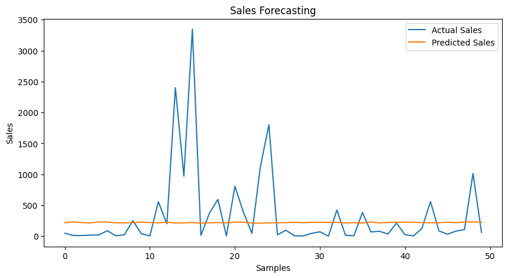

# Sales & Demand Forecasting for Businesses

## Project Objective

The objective of this project is to build a machine learning model that can forecast future sales using historical business data. The project uses sales records, time-based feature engineering, and Linear Regression to predict future sales trends and help businesses make better planning and inventory decisions.

---

## Technologies & Tools Used

- Python
- Pandas
- NumPy
- Matplotlib
- Scikit-learn
- Jupyter Notebook
- VS Code
- GitHub

---

## Dataset Information

The dataset contains historical sales records including:
- Order Date
- Sales Information
- Customer Details
- Product Categories
- Regional Information

The dataset was processed and cleaned before training the forecasting model.

---

## Project Workflow

### 1. Data Loading
Imported the sales dataset using Pandas.

### 2. Data Preprocessing
- Cleaned dataset
- Converted date columns into datetime format
- Handled date formatting issues

### 3. Feature Engineering
Created time-based features:
- Year
- Month

### 4. Model Building
Used Linear Regression model from Scikit-learn for forecasting future sales.

### 5. Model Training
Split the dataset into:
- Training Data
- Testing Data

Then trained the model using historical sales information.

### 6. Prediction
Generated future sales predictions using the trained model.

### 7. Model Evaluation
Evaluated model performance using:
- Mean Absolute Error (MAE)

### 8. Data Visualization
Visualized Actual Sales vs Predicted Sales using Matplotlib graphs.

---

## Forecast Graph

---

## Output

The forecasting model successfully predicted future sales trends using historical business data. The prediction graph shows that the predicted sales values follow the overall pattern of actual sales values.

---

## Business Insights

- Sales forecasting helps businesses estimate future demand.
- Historical sales patterns can improve inventory planning.
- Forecasting models support better business decision-making.
- Time-based analysis helps identify sales trends across months and years.

---

## Conclusion

This project successfully demonstrates Sales & Demand Forecasting using Machine Learning techniques. Historical sales data was processed, analyzed, and used to train a Linear Regression forecasting model. The project generated future sales predictions and visualized forecasting trends that can help businesses improve operational planning and decision-making.

---

## Future Improvements

- Use advanced forecasting algorithms like Random Forest or XGBoost
- Add seasonal trend analysis
- Improve prediction accuracy with more features
- Deploy model using Flask or Streamlit

---

## Author

**Thriveni Nagulapati**  
Machine Learning Intern – Future Interns
